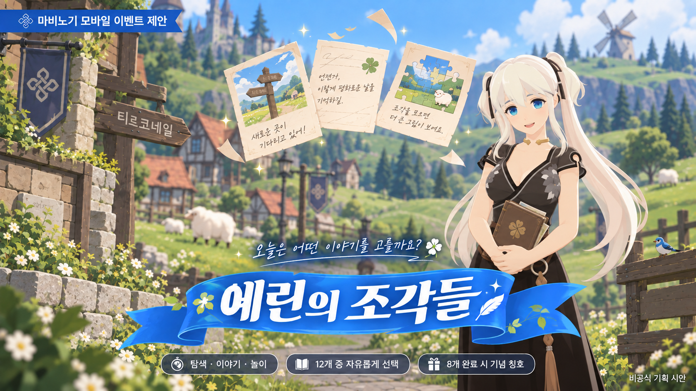
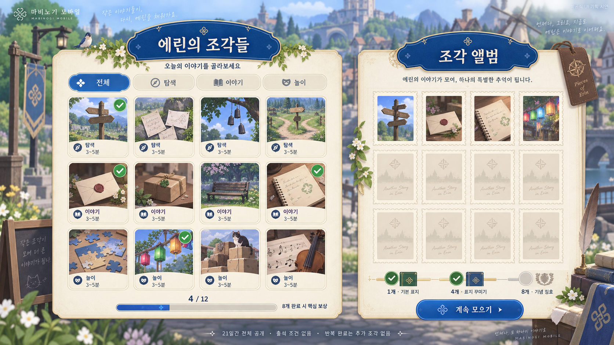

> 이 문서는 이전 작성본이다. 제출·검토에는 [최종 기획서](./2026-09-17_마비노기모바일_에린의조각들_이벤트기획서_최종본.md)를 사용한다.

# 이벤트 기획서 원페이저 — 에린의 조각들

**마비노기 모바일 · 『트렌드 코리아 2026』 픽셀라이프 기반**  
**오늘은 어떤 이야기를 고를까요?**

### 한 문장 기획

탐색·이야기·놀이로 나뉜 **12개 짧은 에피소드 중 원하는 활동을 골라**, 나만의 에린 기록을 모으는 선택형 이벤트.

### 왜 이 이벤트인가

픽셀라이프의 작고 다양한 경험·세분화된 관심을 ‘활동 선택권’으로 적용한다. 마비노기 모바일의 이야기 전달 사례와 연결해 짧게 참여해도 하나의 결말이 남도록 설계한다. 기존 출석·특정 활동 반복 이벤트와 비교하면 **처음 완료한 서로 다른 경험**을 누적한다는 차이가 있다. [S1·S3·S6·S7]

| 핵심 항목 | 계획안 |
|---|---|
| 대상·목적 | 짧은 접속에서 세계관과 전투 외 활동을 경험하고 싶은 이용자에게 완결감·선택권 제공 |
| 참여 | 메뉴 → 이벤트 → 활동 선택 → 짧은 행동·선택 → 조각·결말 기록 → 앨범 |
| 구성 | 탐색 4개 / 이야기 4개 / 놀이 4개. 각 3~5분 목표 |
| 일정 | 21일간 12개 전체 공개, 종료 후 7일간 보상 수령 |
| 핵심 규칙 | 선행 활동·출석·일일 조각 제한 없음. 첫 완료만 조각 1장, 최대 12장 |
| 보상 | 1개: 기본 표지 / 4개: 표지 꾸미기 / 8개: 기념 칭호. 12개는 앨범 완성 표시 |
| 운영 | 중간 단계 저장, 서버별 진행 공유, 반복·중복 지급 방지, 미수령 보상 자동 지급 |
| 평가 | 첫 참여 전환·8종 달성·활동별 중단·활동 시간·체감 부담을 함께 확인 |

**기획의 설득점:** 짧은 길이뿐 아니라 활동의 다양성과 순서 선택을 제공한다. 모든 활동을 완료하지 않아도 핵심 보상을 얻고, 한 활동만 즐겨도 기록이 남는다.

기간·수량·시간은 기획 제안값이며 예상 성과는 실측 결과가 아니다. 공식 배너를 참고해 만든 그림은 비공식 제안용 시안이다.

---

# 상세 이벤트 기획서

작성일·자료 확인일: 2026-09-17  
문서 상태: 과제용 기획서에 원페이저·시각 자료를 보완하고 문서 검토 완료. 실제 운영 예정 이벤트가 아닌 신규 제안.

## 목차

0. 이벤트 기획서 원페이저 — 문서 맨 앞
1. 트렌드 분석
2. 관련 현황 및 기존 이벤트 분석
3. 게임 선정 및 선정 이유
4. 기획 배경 및 목적
5. 이벤트 콘셉트
6. 이벤트 상세 기획
7. 운영 방안 및 예상 문제
8. 기대 효과 및 평가 방법
9. 참고 자료 및 확인 범위

## 1. 트렌드 분석

### 1.1 주요 키워드: 픽셀라이프

『트렌드 코리아 2026』의 픽셀라이프를 주요 키워드로 선정한다. 공개 발췌에서는 하나의 큰 유행보다 세분화된 마이크로 트렌드가 나타나는 변화를 설명한다. 공개 페이지에 해당 발췌는 p.268로 표기되어 있다. [S1]

이 기획에서는 이를 ‘이용자가 작고 다양한 경험을 자신의 관심에 따라 선택하는 소비 양상’으로 해석한다. 게임 적용은 아래 세 요소로 정리한다.

| 적용 요소 | 설계에 반영할 내용 |
|---|---|
| 작은 경험 단위 | 에피소드 하나에서도 시작·행동·결말을 경험 |
| 다양한 관심 | 탐색·인물 이야기·가벼운 놀이 중 선택 |
| 빠른 전환과 자율성 | 활동 순서와 참여 시점을 이용자가 결정 |

픽셀라이프는 픽셀 그래픽을 뜻하지 않는다. 플레이 시간을 줄이는 것만으로 트렌드를 반영했다고 보기 어렵다. 이 이벤트의 핵심은 여러 작은 경험과 선택권이다.

### 1.2 다른 후보와의 비교

| 후보 | 게임 적용 가능성 | 이번 기획에서의 판단 |
|---|---|---|
| 픽셀라이프 | 짧고 다양한 활동, 선택형 참여 구조 | 주요 근거로 선정 |
| 필코노미 | 기분 전환과 캐릭터 애착을 주는 경험 | 따뜻한 이야기의 표현 방향으로 참고 |
| 근본이즘 | 원작 고유의 지역·활동을 재발견 | 비교 후보로 남김 |

필코노미는 감정이 소비를 이끄는 현상, 근본이즘은 원형의 가치와 진정성을 다시 찾는 관점으로 이해한다. 책의 공개 발췌·목차를 참고한 요약이다. 이번 기획에서는 세 키워드를 모두 주요 근거로 내세우기보다 픽셀라이프와 참여 구조의 연결에 집중한다. [S1]

## 2. 관련 현황 및 기존 이벤트 분석

### 2.1 인벤 기사에서 확인한 흐름

| 자료 | 확인한 내용 | 기획에 적용할 해석 | 해석의 한계 |
|---|---|---|---|
| GDC 강연 보도, 2026-03-11 | 숏폼과 경쟁하는 환경에서 짧고 밀도 있는 경험의 가능성을 제시 | 이벤트 한 활동에도 완결감 제공 | 발표자의 전망이며 시장 전체의 변화가 입증된 결과는 아님 |
| 마비노기 모바일 NDC 강연 보도, 2026-06-17 | 이야기를 실제 플레이로 전달하고 몰입과 템포를 조정하는 제작 사례 소개 | 설명을 읽는 것에 그치지 않고 선택·행동으로 이해하도록 구성 | 메인 퀘스트 사례이며 이벤트 효과를 검증한 자료는 아님 |
| 네오위즈 실적발표 보도, 2026-05-11 | 팬덤 중심 운영과 콘서트·팝업 등 경험 확장 전략 소개 | 보상 외에 기억할 만한 경험을 제공할 여지 | 기업 전략이며 전체 이용자의 선호를 뜻하지 않음 |
| 대만 7월 시장 리포트 | 클래식 IP 및 원작 감성을 다루는 사례 소개 | 익숙한 세계를 새로운 작은 경험으로 보여줄 여지 | 특정 지역 사례를 국내 전체 시장으로 일반화하지 않음 |

위 자료는 인벤의 [GDC 보도](https://www.inven.co.kr/webzine/news/?news=314255), [NDC 제작 사례](https://www.inven.co.kr/webzine/news/?news=317541), [네오위즈 발표 보도](https://www.inven.co.kr/webzine/news/?news=316289), [대만 시장 리포트](https://www.inven.co.kr/webzine/news/?news=319842)를 참고했다. [S2–S5]

이를 통해 ‘짧은 길이와 몰입을 함께 고려하는 경험’이라는 기획 기회를 도출한다. 짧은 활동을 늘리는 것보다, 각 활동의 차이를 체감하고 원하는 활동을 고를 수 있도록 설계한다.

### 2.2 공식 이벤트와의 비교

2026년 9월 17일 확인한 공식 공지 두 건을 비교 대상으로 삼았다.

| 항목 | 추석맞이 매일매일 출석 | 다함께 팽이치기 | 본 제안: 에린의 조각들 |
|---|---|---|---|
| 주요 참여 | 접속에 따른 출석 | 특정 사이드 게임 플레이 | 서로 다른 에피소드 선택·완료 |
| 누적 기준 | 출석 일수 | 해당 활동의 플레이 횟수 | 처음 완료한 에피소드 종류 수 |
| 보상 구조 | 일차별 선물 | 1·2·3회 미션 선물 | 1·4·8종 완료 시 기록·꾸미기 보상 |
| 기간 중 재진입 | 다음 출석 일수 진행 | 활동 횟수 추가 | 원하는 미완료 에피소드 또는 이어하기 선택 |

출석 이벤트는 접속 시 자동 출석되며 매일 오전 6시에 초기화되고, 14일차까지 보상이 제시되어 있다. 팽이치기 이벤트는 사이드 게임에서 참여하고 서버 단위로 횟수가 누적되며, 이벤트 탭에서 미션 선물을 받는 구조다. [공식 출석 공지](https://mabinogimobile.nexon.com/News/Events/3545044), [공식 팽이치기 공지](https://mabinogimobile.nexon.com/News/Events/3545040) [S6–S7]

기존 이벤트가 이용자에게 부담스럽거나 성과가 낮다는 자료는 확인하지 않았다. 본 제안은 기존 방식의 실패를 전제하지 않고, 다양한 경험의 선택이라는 별도의 참여 동기를 추가하는 안이다. 조사한 두 건과의 차이는 설명할 수 있지만, 모든 과거 이벤트와 중복이 없다고 단정하지 않는다.

## 3. 게임 선정 및 선정 이유

### 3.1 선정 게임: 마비노기 모바일

게임 선정의 근거는 다음과 같다.

1. 인벤에 실제 퀘스트 제작 사례가 있어 트렌드와 플레이 경험의 연결을 설명할 수 있다. [S3]
2. 공식 이벤트에 메뉴·이벤트 탭 및 사이드 게임을 통한 진입 구조가 확인된다. 새로운 이벤트도 이용자가 익숙한 진입 방식으로 제안할 수 있다. [S6–S7]
3. 공식 지역 소개에 티르코네일·던바튼·콜헨이 제시되어 있어 지역과 일상의 이야기로 콘셉트를 구체화할 수 있다. [S8]

현재 게임의 인구 구성이나 접속 시간 분포는 확인하지 않았다. ‘짧게 접속하는 이용자가 다수’라고 주장하지 않고, 이번 이벤트가 제공하려는 경험에 맞춰 대상을 설정한다.

### 3.2 기존 요소와 신규 제작 요소

| 구분 | 내용 |
|---|---|
| 자료로 확인한 기존 요소 | 퀘스트 기반 이야기 전달, 공식 이벤트 탭 진입, 사이드 게임, 에린 지역 소개 |
| 신규 제안 요소 | 12개 에피소드, 선택판, 에피소드 체크포인트, 조각 수집 진행도, 조각 앨범, 기념 꾸미기 보상 |
| 추가 확인이 필요한 사항 | 지역 진입 조건, 기존 퀘스트 기능의 재사용 범위, 기념 보상의 적용 위치·기능, 제작 공수 |

새로운 에피소드·앨범이 현재 게임에 존재한다고 표현하지 않는다. 티르코네일을 배경으로 하되 기존 지역의 진입 조건에 막히지 않는 공용 이벤트 진입을 새로 마련하는 안이다.

## 4. 기획 배경 및 목적

### 4.1 기획 배경

픽셀라이프 관점에서는 하나의 정해진 활동을 반복하기보다 자신의 관심에 맞는 작은 경험을 골라 즐길 수 있는 구조를 검토할 수 있다. 마비노기 모바일의 이야기 전달 사례를 참고해, 짧은 에피소드에서도 선택과 결말을 경험하도록 만든다.

### 4.2 대상과 목적

| 대상 | 제공하려는 경험 |
|---|---|
| 짧은 접속 중 한 활동을 즐기고 싶은 이용자 | 에피소드 하나만 완료해도 기록과 결말 획득 |
| 세계관·인물의 이야기를 즐기는 이용자 | 설명보다 행동과 선택으로 일상을 경험 |
| 전투 외의 활동을 살펴보고 싶은 이용자 | 탐색·대화·놀이 중 관심에 따라 선택 |

주요 목적은 **짧은 참여에서도 완결감을 주고, 활동의 종류와 순서를 이용자가 고르게 하는 것**이다. 운영 측면에서는 서로 다른 유형의 활동에 대한 참여와 재진입을 관찰한다. 매출 상승이나 이탈 감소를 보장하는 기획으로 제시하지 않는다.

## 5. 이벤트 콘셉트

### 5.0 메인 배너의 기획 의도

원페이저의 배너는 공식 [출석 이벤트](https://mabinogimobile.nexon.com/News/Events/3545044)와 [팽이치기 이벤트](https://mabinogimobile.nexon.com/News/Events/3545040)의 실제 배너를 화면으로 확인한 후, 밝은 풍경·셀 셰이딩 캐릭터·파란 제목 띠를 참고해 새로 생성했다. 공식 게시물이 아닌 제안용 이미지다.

공식 캐릭터 소개의 [나오 이미지](https://lwi.nexon.com/m_mabinogim/brand/info/npc/nao_31526CCC2F9512B9.png)를 화면으로 확인한 후, 머리·눈·드레스·장식을 참고해 게임의 3D 모델을 배치한 듯한 표현으로 수정했다. 나오가 앨범을 들고 탐색·이야기·놀이를 상징하는 기록이 떠오르는 장면으로 ‘작은 경험을 모은다’는 콘셉트를 전달한다. 나오의 등장과 소품은 홍보 연출 제안이며 공식 출연 계획이 아니다. 하단에는 12개 선택과 8개 핵심 보상을 함께 보여준다. 실제 모델 파일을 렌더링하거나 공식 이미지를 직접 합성한 결과가 아닌 생성 시안이며, 배경의 실제 지역 구조는 검증하지 않았다.

### 5.1 핵심 아이디어

**이벤트명: 에린의 조각들**  
**소개 문구: 오늘은 어떤 이야기를 고를까요?**

에린의 작은 일상을 12장의 에피소드로 나눈다. 이용자는 탐색·인물 이야기·놀이 중 원하는 에피소드를 골라 짧은 사건을 해결하고, 기념 조각 한 장을 앨범에 남긴다. 모인 조각은 이용자가 경험한 에린의 모습을 보여준다.

### 5.2 트렌드와 규칙의 연결

| 트렌드 해석 | 대응 규칙 | 의도 |
|---|---|---|
| 작고 다양한 경험 | 3개 유형, 총 12개 에피소드 | 관심에 맞는 활동을 선택 |
| 활동 사이의 빠른 전환 | 선행 에피소드 없이 전체 공개 | 정해진 순서에 묶이지 않음 |
| 개인화된 경험 | 선택에 따라 짧은 결말 기록 변화 | 자신의 경험으로 기억 |
| 작은 단위의 만족 | 매 에피소드 조각 지급 | 전체 완주 전에도 결과를 확인 |

## 6. 이벤트 상세 기획

이하 기간·수량·시간·기능은 실제 공지가 아닌 **기획 제안값**이다.

### 6.1 운영 조건

| 항목 | 제안 |
|---|---|
| 플레이 기간 | 시작일 오전 6시부터 21일간, 종료는 시작 21일 후 오전 6시. 한국 시간 기준 |
| 보상 정리 기간 | 플레이 종료 후 7일간 앨범 조회·달성 보상 수령 가능 |
| 참여 조건 | 기본 조작 튜토리얼을 마친 캐릭터. 구체적인 실제 퀘스트명은 공식 조건 확인 후 매핑 |
| 진행·보상 단위 | 계정의 서버별 1회 진행도. 같은 서버의 캐릭터들이 진행도 공유 |
| 진입 | 메뉴 → 이벤트 → 에린의 조각들 → 활동 선택 |
| 공개 방식 | 시작일부터 12개 전체 공개 |
| 일일 제한 | 첫 완료 조각에 일일 획득 제한 없음. 출석 조건 없음 |
| 활동 길이 | 진입부터 결말까지 에피소드당 3~5분 목표. 실측값 아님 |
| 핵심 보상 기준 | 서로 다른 8개 에피소드 완료 |
| 전체 수집 | 12개 완료 시 앨범 완성 표시. 별도 추가 보상 없음 |

시작일의 실제 날짜는 운영 일정에 따라 결정한다. 하루 초기화에 의존하지 않는 구조라 늦게 참여해도 남은 활동을 진행할 수 있다. 전체 완료 목표 시간은 36~60분, 핵심 보상까지 24~40분이며 이동·로딩·재시도 시간은 별도다.

### 6.2 에피소드 목록

모든 에피소드는 전투력·확률 드롭·재화 지출·타인 매칭 없이 진행하도록 새로 제작한다. 배경은 티르코네일의 일상을 바탕으로 한 공용 이벤트 공간이며 아래 인물 역할과 사건은 창작 설정이다.

| ID | 유형 | 제목 | 플레이와 완료 조건 |
|---|---|---|---|
| A1 | 탐색 | 길 잃은 안내판 | 세 표식을 확인하고 목적지 안내판의 방향을 바로잡음 |
| A2 | 탐색 | 바람에 날린 쪽지 | 순서와 무관하게 쪽지 세 장을 발견해 게시판에 붙임 |
| A3 | 탐색 | 마을의 작은 소리 | 세 관찰 지점을 확인하고 마음에 드는 소리의 장소를 기록 |
| A4 | 탐색 | 돌아가는 두 갈래 길 | 두 경로 중 하나로 이동하며 표식을 확인하고 도착 |
| B1 | 이야기 | 전하지 못한 인사 | 대화 두 번과 선택 한 번으로 인사 전달 |
| B2 | 이야기 | 오늘의 작은 부탁 | 부탁 두 가지 중 하나를 선택해 전용 소품 전달 |
| B3 | 이야기 | 비어 있는 한 자리 | 마을 인물의 이야기를 듣고 어울리는 메모를 선택 |
| B4 | 이야기 | 내일의 약속 | 대화의 답을 고르고 다음 만남의 약속을 기록 |
| C1 | 놀이 | 뒤섞인 조각 맞추기 | 세 그림 조각을 제자리에 배치 |
| C2 | 놀이 | 색깔을 기억해요 | 색깔 순서를 맞춤. 틀리면 힌트와 함께 재시도 |
| C3 | 놀이 | 작은 소포 정리 | 소포 세 개를 표시에 따라 분류 |
| C4 | 놀이 | 마을의 리듬 | 표시되는 세 입력을 완료. 속도 평가·순위 없음 |

오디오가 없어도 A3을 진행할 수 있도록 관찰 설명을 제공한다. C2는 색깔 외에 모양·글자도 표시하고, C4는 시간 제한 없는 입력 방식을 기본으로 한다. 정답을 찾는 활동은 힌트 후 재시도하며, 이야기 선택에는 보상 차이나 정답을 두지 않는다.

### 6.3 공통 진행 흐름

1. 선택판에서 유형, 예상 길이, 조각 획득 여부를 확인한다.
2. 활동을 선택하고 짧은 상황 안내를 본다.
3. 두세 번의 행동과 선택으로 사건을 진행한다.
4. 결말과 조각을 확인한다. 조각은 첫 완료 시 자동 기록된다.
5. 앨범을 보거나 다음 활동을 고른다. 다음 활동을 강제로 시작하지 않는다.

진행 중 활동을 바꾸면 완료된 행동 단계까지 저장한다. 같은 서버에서 한 활동만 진행 상태로 유지하며, 재진입 시 이어하기 또는 처음부터를 고른다. 처음부터를 선택해도 이미 얻은 조각·누적 완료 수는 사라지지 않는다. 게임을 종료해도 저장된 단계부터 이어갈 수 있도록 제작한다.

### 6.4 조각·반복·선택 규칙

- 조각은 에피소드 ID마다 첫 완료에 1장씩, 최대 12장이다.
- 반복 플레이는 결말을 다시 보는 용도이며 조각이나 누적 완료 수를 추가하지 않는다.
- 한 에피소드의 다른 결말을 보더라도 완료 종류 수는 1개다. 앨범에는 본 결말들을 저장하고 대표 결말을 고를 수 있도록 제안한다.
- 모든 에피소드는 독립적이며 선행 조건이 없다. 유형별 최소 완료 조건도 없다.
- 보상은 미완료 활동을 권유할 수 있지만, 미접속일 보충이나 연속 출석을 요구하지 않는다.

### 6.5 보상

| 달성 조건 | 신규 제안 보상 | 지급 방식 |
|---|---|---|
| 각 에피소드 첫 완료 | 해당 기념 조각·결말 기록 1개 | 완료 시 앨범 자동 반영 |
| 1종 완료 | 기본 조각 앨범 표지 | 자동 적용 |
| 4종 완료 | 앨범 표지 꾸미기 1종 | 이벤트 탭에서 1회 수령 |
| 8종 완료 | 기념 칭호 ‘조각을 모은 여행자’ 1개 | 이벤트 탭에서 1회 수령 |
| 12종 완료 | 앨범의 전체 수집 완료 표시 | 자동 표시, 추가 아이템 없음 |

보상명은 창작안이다. 표지 꾸미기와 칭호는 능력치·전투력 효과 없이 사용하며 거래 불가로 제안한다. 앨범은 서버별 공유하고 칭호는 수령 시 지정한 캐릭터에 귀속한다. 수령 캐릭터 확인 창을 제공한다. 칭호의 실제 게임 내 적용 방법은 개발 검토가 필요하다.

골드·강화 재료·확률형 상자는 지급하지 않는 안이다. 다만 외형 보상도 기존 상품과의 관계 및 이용자 선호를 검토해야 하므로 경제 영향이 전혀 없다고 단정하지 않는다.

활동 종료 후 7일 동안 달성했으나 받지 않은 보상을 수령할 수 있다. 정리 기간 종료 시 미수령 보상은 서버별 최초 참여 캐릭터로 자동 지급하고 그 기준을 처음부터 안내한다. 앨범 표지 꾸미기는 서버별 앨범에 자동 등록된다. 인벤토리 공간과 무관한 전용 보상함·등록 방식은 신규 구현 제안이다.

### 6.6 화면 구성안

왼쪽은 12개 활동 중 고르는 화면, 오른쪽은 조각이 쌓이는 앨범과 보상 단계다. 4개를 완료한 예시로 완료 표시·앨범의 수집 기록·진행도 4/12를 맞췄다. 1개와 4개 보상은 달성, 8개 기념 칭호는 미달성 상태를 보여준다. 그림의 유형별 삽화는 표현 예시이며 활동의 실제 규칙은 본문을 기준으로 한다.

| 화면 | 보여줄 정보 |
|---|---|
| 이벤트 시작 | 소개 한 문장, 종료 시각, 핵심 보상 기준 |
| 활동 선택판 | 유형 필터, 12개 카드, 미완료·진행 중·완료, 예상 길이 |
| 활동 진행 | 현재 행동과 다음 위치, 나가기·이어하기 안내 |
| 결과 | 결말, 새 조각, 누적 완료 수, 앨범·선택판 이동 |
| 앨범 | 수집한 기록, 아직 비어 있는 칸, 대표 결말 선택 |
| 보상 | 1·4·8종 조건, 달성·미달성·수령 완료, 수령 캐릭터 |

12장 중 8장으로 핵심 보상을 받는다는 사실을 진행도 옆에 함께 표시한다. 활동 종료 뒤에는 새 활동 진입을 막고 보상 정리 기간을 별도로 표시한다. 정리 기간 이후에도 획득한 앨범·기념 보상을 조회할 수 있게 보관한다.

### 6.7 참여 예시

이용자 민수는 접속 후 A2 ‘바람에 날린 쪽지’를 고른다. 쪽지를 붙이고 조각 한 장과 기본 표지를 받는다. 다른 날에는 B1을 중간까지 진행하다 종료하고, 다음 접속에서 이어서 마친다. 이후 관심에 따라 A형 3개, C형 3개를 추가로 완료하면 서로 다른 에피소드가 총 8개가 되어 기념 칭호를 받는다.

매일 접속하지 않아도 되고 B2~B4, C4를 남겨둬도 핵심 보상을 얻는다. 모든 활동이 처음부터 공개되므로 남은 기간에 몰아서 진행할 수도 있지만 이를 권장하거나 추가 보상하지 않는다.

## 7. 운영 방안 및 예상 문제

### 7.1 운영 일정안

| 시점 | 작업 |
|---|---|
| 시작 전 | 안내 공지·보상 귀속·자동 지급 기준 공개, 기능 및 이용자 검증 |
| 시작~21일 | 12개 활동 전체 공개, 참여·중단·오류 지표 확인 |
| 기간 중 | 오류 수정, 규칙 변경이 필요하면 변경점과 적용 시점 공지 |
| 종료 3일 전 | 종료·미수령 보상 안내. 완료를 강요하는 경고 문구는 피함 |
| 플레이 종료~7일 | 신규 완료 차단, 달성 보상 수령과 앨범 조회 유지 |
| 정리 기간 종료 | 미수령 보상 자동 지급, 결과 분석 |

실제 날짜와 담당 인력 수는 미정이다. 역할은 콘텐츠 기획, 이야기 작성, UI·개발, 아트, QA, 운영으로 나누며 실제 팀 구성이라고 주장하지 않는다.

### 7.2 제작 범위

필수 범위는 12개 짧은 에피소드, 선택판·진행도·앨범 화면, 체크포인트 저장, 서버별 조각·보상 관리, 기념 보상, 참여 로그다. 음성 녹음·오프라인 행사·외부 SNS 업로드·신규 경쟁전은 이번 제안 범위에 포함하지 않는다.

실제 제작 공수는 기존 퀘스트·UI·저장 기능의 재사용 가능성을 확인한 뒤 산정한다. 모든 에피소드가 3~5분에 맞는지는 플레이 검증으로 확인해야 한다.

### 7.3 예상 문제와 대응

| 상황 | 대응 규칙 |
|---|---|
| 일일 숙제로 받아들임 | 출석·일일 조각 제한 없이 전체 공개, 8종으로 핵심 보상 |
| 선택이 많아 진입이 어려움 | 유형·예상 길이 표시, 미완료 한 가지를 추천하되 자유 변경 |
| 새 이용자의 지역·장비 조건 | 튜토리얼 후 공용 이벤트 진입, 전투력 판정 없음 |
| 중간 종료·다른 캐릭터로 접속 | 서버별 행동 단계 저장, 완료 조각 공유 |
| 다른 기기에서 동시에 진행 | 서버별 진행 세션 하나만 허용, 두 번째 진입에는 이어하기 안내 |
| 중복 완료·보상 수령 | 에피소드별 첫 완료만 인정, 달성 보상은 조건별 1회 |
| 통신 끊김 직전 완료 | 서버에 기록된 완료 기준으로 복구, 결과 재조회 후 누락 보상 지급 |
| 보상 캐릭터 오선택 | 수령 전 귀속 안내, 자동 지급 기본 캐릭터를 시작 시 명시 |
| 종료 시각을 넘겨 진행 | 종료 직전 경고, 종료 시 미완료는 조각 지급하지 않음. 오류·장애는 별도 보상 검토 |
| 콘텐츠 버그로 8종 달성이 어려움 | 정상 활동 수를 확인해 기한 연장 또는 대체 완료 경로 공지 |
| 기록을 위해 모든 결말 반복 | 추가 재화 보상 없음, 이미 본 기록을 표시 |

운영 전에는 첫 참여, 1·4·8종 보상, 반복 완료, 서버·캐릭터 전환, 통신 끊김, 종료 경계, 자동 지급을 확인한다. 이는 필요한 검증 목록이며 실제 실행한 테스트 결과가 아니다.

## 8. 기대 효과 및 평가 방법

### 8.1 기대 효과

- 짧은 접속에서도 결과가 남아 작은 만족을 얻을 수 있다.
- 관심에 따라 활동을 선택하며 서로 다른 일상을 경험할 수 있다.
- 완료 수 외에 자신이 고른 결말과 기록이 참여의 의미가 될 수 있다.

모두 기획상 기대이며 운영 결과는 아니다. 내부 기준선이 없으므로 상승률이나 목표 참여자 수를 임의로 제시하지 않는다.

### 8.2 지표 정의

분석 단위는 ‘계정×서버’이며 아래 수치는 플레이 기간 전체의 중복 제거 단위로 집계한다. 여러 서버 참여를 전체 계정 이용자 수로 보고할 때는 별도로 계정 중복을 제거한다.

| 지표 | 계산 또는 관찰 방법 | 판단할 내용 |
|---|---|---|
| 첫 참여 전환율 | 1종 이상 완료 단위 수 ÷ 참여 자격을 갖추고 이벤트 선택판을 연 단위 수 | 선택판에서 실제 완료로 이어지는가 |
| 핵심 보상 달성률 | 8종 이상 완료 단위 수 ÷ 1종 이상 완료 단위 수 | 핵심 경험의 도달 정도 |
| 다양한 유형 경험 비율 | 2개 이상 유형을 완료한 단위 수 ÷ 1종 이상 완료 단위 수 | 여러 유형으로 관심이 확장되는가 |
| 활동별 완료율 | 해당 활동을 처음 시작한 단위 중 완료한 수 ÷ 처음 시작한 수 | 특정 활동에 이탈이 몰리는가 |
| 활동 길이 | 처음 시작부터 완료까지 실제 활동 시간의 중앙값·상위 90% 값. 오프라인 시간 제외 | 3~5분 목표와 부담 수준 |
| 기간 내 재참여율 | 첫 완료 후 다른 날 추가 첫 완료가 있는 단위 수 ÷ 종료 3일 전까지 첫 완료한 단위 수 | 일일 강제 없이 다시 참여하는가 |
| 보상 미수령률 | 4·8종 각 보상별 정리 기간 종료 직전 미수령 수 ÷ 해당 보상 달성 수 | 수령 안내가 충분한가 |
| 체감 부담·기억 | 자율 설문으로 숙제 느낌, 선택권, 기억에 남은 활동 확인 | 수치로 알기 어려운 경험 |

분모가 0이면 비율을 계산하지 않는다. 이벤트 진입→시작→행동 저장→완료→보상 수령을 기록하고, 정리 기간의 수령 로그는 플레이 집계와 구분한다. 설문은 자발적 응답자 편향을 표시한다.

### 8.3 평가 시 주의점

달성률이 높더라도 보상 때문에 부담을 참고 참여했을 수 있으므로, 활동 시간·중단·설문을 함께 본다. 참여가 한 유형에 집중되어도 선택권을 활용한 결과일 수 있어 그 자체를 실패로 판단하지 않는다. 재참여하지 않았어도 한 에피소드에 만족한 이용자가 있을 수 있다.

이벤트 전후 접속 변화는 다른 업데이트의 영향도 받는다. 충분한 비교 설계 없이 이 이벤트가 잔존율이나 매출을 올렸다고 결론내리지 않는다.

## 9. 참고 자료 및 확인 범위

시각 자료: 내장 이미지 생성 도구로 메인 배너와 선택판·앨범 시안을 새로 만들었다. 공식 이미지의 관찰 기록·산출물·최종 생성 프롬프트는 [시각 자료 제작 기록](./assets/erins-fragments/VISUAL_NOTES.md)에 정리했다. 이미지에 비공식 기획 시안 표시를 포함했다.

| ID | 출처 | 사용 범위 |
|---|---|---|
| S1 | [『트렌드 코리아 2026』 도서 소개·목차·공개 발췌 — YES24](https://m.yes24.com/goods/detail/153064968) | 키워드와 의미의 근거. 픽셀라이프 공개 발췌 표기 p.268 |
| S2 | [GDC26: 숏폼 맞선 게임, 50달러 미만 단기 플레이로 재편 — 인벤](https://www.inven.co.kr/webzine/news/?news=314255) | 발표자의 짧은 경험에 대한 전망 |
| S3 | [NDC26: 숏폼의 시대, 경험하는 이야기를 위한 마비노기 모바일의 고민 — 인벤](https://www.inven.co.kr/webzine/news/?news=317541) | 퀘스트 제작 사례와 몰입·템포의 고민 |
| S4 | [네오위즈, P의 거짓 차기작 본격 개발 단계 진입했다 — 인벤](https://www.inven.co.kr/webzine/news/?news=316289) | 기업의 팬덤 중심 전략 |
| S5 | [클래식 붐과 서브컬처 축제까지 뜨거웠던 대만 7월 게임 시장 — 인벤](https://www.inven.co.kr/webzine/news/?news=319842) | 지역 시장 비교 사례 |
| S6 | [추석맞이 매일매일 출석 이벤트 — 공식 공지](https://mabinogimobile.nexon.com/News/Events/3545044) | 출석 일수와 보상·초기화 규칙 |
| S7 | [다함께 팽이치기 이벤트 — 공식 공지](https://mabinogimobile.nexon.com/News/Events/3545040) | 사이드 게임 진입 및 누적 횟수 미션 |
| S8 | [에린의 지역 — 공식 소개](https://mabinogimobile.nexon.com/Info/World) | 티르코네일·던바튼·콜헨 지역명 |

공개 자료에 접근해 위 설명을 확인했다. 공식 콘텐츠 소개 페이지는 확인 과정에서 점검 페이지로 연결되어 상세 콘텐츠의 근거로 사용하지 않았다. 에린 가이드 목록은 확인했지만 개별 가이드로 모든 기능을 검증한 것으로 쓰지 않는다.

책 전체 정독, 게임 내 플레이, 내부 지표 분석, 개발팀의 공수·구현 가능성 검증은 수행하지 않았다. 과제 제출 전에는 다음을 보완하면 좋다.

- 책의 픽셀라이프 장을 읽고 공개 발췌 밖의 의미와 사례를 보완한다.
- 실제 게임에서 튜토리얼·지역 진입·이벤트 메뉴를 확인한다.
- 과거 선택형·앨범형 이벤트와의 중복 여부를 추가 조사한다.
- 제작 담당자와 저장·보상·칭호 기능 재사용 범위를 확인한다.

이 기획서의 작성 완료는 이벤트의 실제 개발·운영·효과 검증 완료를 의미하지 않는다.
